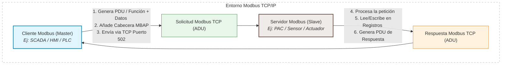
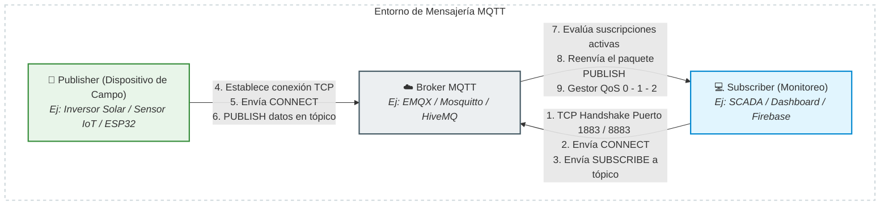

# PROTOCOLOS INDUSTRIALES.

## Modbus TCP

Modbus es un protocolo de comunicación ampliamente utilizado en la automatización industrial, permite que distintos dispositivos electrónicos como: PLCs, sensores, variadores de frecuencia y sistemas SCADA, se comuniquen entre sí de forma sencilla y estandarizada sin importar el idioma que usen.

Muy conocido y usado debido a su simplicidad, compatibilidad y fiabilidad, ya que Modbus a diferencia de otros protocolos más complejos este es: abierto, fácil de implementar y muy robusto en entornos industriales exigentes.

Históricamente Modbus empleó la terminología maestro–esclavo; sin embargo, las implementaciones modernas basadas en TCP/IP adoptan el modelo cliente–servidor. En este caso el maestro es quien inicia la comunicación y solicita información y los esclavos son aquellos dispositivos que se encargan de responder las peticiones el maestro entregando datos que pide el maestro o actualizando los valores cuando el maestro envía.

Es la evolución del protocolo clásico de Modbus RTU, adaptando su estructura de datos en encapsulamiento dentro de un paquete TCP estándar.

Por otro lado el protocolo TCP (protocolo de control de transmisión) es un estándar de comunicación que permite que programas de aplicaciones y dispositivos informáticos puedan intercambiar información a través de una red. Se diseñó para el envío de paquetes de información a través de internet y garantizar la entrega de datos y mensajería exitosa.

TCP es un protocolo de transporte perteneciente a la suite TCP/IP encargado de garantizar la entrega confiable y ordenada de los datos, y se incluye estándares definidos por el Grupo de trabajo de ingeniería de internet (Internet Engineering Task Force, IETF).

TCP organiza los datos para que se puedan transmitir entre servidor y cliente. Garantiza que la llegada de estos datos de un extremo a otro en una red se cumpla, antes de realizar la transmisión, el TCP forma una conexión entre una fuente y su destino para que permanezca activa durante la inicialización. Luego se encarga de dividir las grandes cantidades en paquetes de datos pequeños y garantiza que se implemente la integridad de los datos durante el proceso de transmisión.

Continuando con el protocolo Modbus TCP, este es una variante de la familia Modbus, este en concreto abarca la mensajería Modbus mediante entornos de intranet o internet mediante protocolos TCP/IP y Ethernet. Es decir, Modbus TCP/IP combina una red física (Ethernet), con un estándar de red como lo es TCP/IP, y un método de representación de datos (Modbus como el protocolo de aplicación).

El puerto estándar en Modbus TCP es el 502/TCP el cual usa el protocolo TCP como estándar de transmisión de datos, permite una comunicación más rápida y flexible. 

A diferencia de RTU, en Modbus TCP la dirección principal no es la del esclavo, sino la dirección IP del dispositivo, lo que simplifica la integración con redes IT y sistemas SCADA.

Otra diferencia importante es que el modelo de comunicación cambia:

- En lugar de “maestro–esclavo”, se utiliza la estructura cliente–servidor.
- Varios clientes pueden acceder simultáneamente a un mismo servidor Modbus, permitiendo múltiples flujos de datos.

#### Ventajas de Modbus TCP/IP:

- Mayor velocidad y capacidad de transmisión de datos.
- Integración directa con Ethernet industrial y sistemas empresariales.
- Mayor escalabilidad y flexibilidad en redes distribuidas.

#### Usos comunes:

- PLC industriales con conexión Ethernet.
- Sistemas SCADA para control y visualización.
- Sensores inteligentes y actuadores con conectividad IP.

#### Arquitectura.



En Modbus TCP, cada trama incorpora una cabecera MBAP (Modbus Application Protocol Header) compuesta por el identificador de transacción, identificador de protocolo, longitud y unidad de identificación.

El cliente, típicamente un sistema SCADA o una estación de ingeniería, envía tramas que contienen un código de función, la dirección del registro objetivo y, en el caso de operaciones de escritura, el valor a registrar. El servidor, que puede ser un inversor, un PLC o cualquier dispositivo de campo compatible, procesa la solicitud y retorna la respuesta correspondiente.

#### Funciones mas utilizadas.

| Código de Función (Hex / Dec) | Nombre Oficial (Estándar Modbus) | Tipo de Acceso | Tipo de Dato / Dirección de Memoria | Descripción / Uso Común                                                                                                                                  |
| :---------------------------: | :------------------------------- | :------------: | :---------------------------------- | :------------------------------------------------------------------------------------------------------------------------------------------------------- |
|         **0x01** / 01         | Read Coils                       |    Lectura     | Bits (0xxxx)                        | Lee el estado (ON/OFF) de salidas digitales o variables booleanas internas.                                                                              |
|         **0x02** / 02         | Read Discrete Inputs             |    Lectura     | Bits (1xxxx)                        | Lee el estado de entradas digitales físicas (sensores, switches). Son de solo lectura.                                                                   |
|         **0x03** / 03         | Read Holding Registers           |    Lectura     | Palabras / 16-bit (4xxxx)           | Lee el valor de registros de configuración o variables de proceso (ej: consignas, calibraciones).                                                        |
|         **0x04** / 04         | Read Input Registers             |    Lectura     | Palabras / 16-bit (3xxxx)           | Lee datos analógicos medidos por el hardware (ej: lecturas de temperatura o voltaje). Solo lectura.                                                      |
|         **0x05** / 05         | Write Single Coil                |   Escritura    | 1 Bit (0xxxx)                       | Fuerza el estado de una única salida digital o bobina interna a ON u OFF.                                                                                |
|         **0x06** / 06         | Write Single Register            |   Escritura    | 1 Palabra / 16-bit (4xxxx)          | Escribe un valor entero de 16 bits en un único registro de retención (Holding Register).                                                                 |
|         **0x0F** / 15         | Write Multiple Coils             |   Escritura    | Múltiples Bits (0xxxx)              | Modifica un bloque secuencial de salidas digitales o variables booleanas en una sola petición.                                                           |
|         **0x10** / 16         | Write Multiple Registers         |   Escritura    | Múltiples Palabras (4xxxx)          | Escribe un bloque de registros de 16 bits. Es muy usado para enviar datos de 32 bits (como variables `Float` o `DINT`) ocupando dos registros contiguos. |

Las funciones de lectura (01 a 04) permiten consultar el estado de salidas digitales, entradas digitales y registros de datos. Las funciones de escritura (05, 06, 15, 16) permiten modificar valores en el dispositivo remoto, lo que en un contexto fotovoltaico equivale a la capacidad de alterar parámetros operativos críticos del inversor.

#### Uso en sistemas fotovoltaicos


En instalaciones de generación solar fotovoltaica, Modbus TCP es el protocolo predominante para la comunicación entre el sistema SCADA y los inversores solares. A través de él se realizan las siguientes operaciones:
 
- **Lectura de potencia instantánea y acumulada:** el SCADA consulta periódicamente los registros de potencia activa y energía generada en el día para el monitoreo de producción.
- **Lectura de voltajes y corrientes:** se accede a los registros de tensión y corriente tanto en la entrada DC como en la salida AC del inversor.
- **Consulta del estado operativo del inversor:** registros que indican si el equipo está activo, en espera, en modo de falla o apagado.
- **Lectura de alarmas y códigos de error:** registros específicos que reportan condiciones anómalas del sistema.
- **Configuración de parámetros:** en algunos modelos de inversores, parámetros como los umbrales de tensión de operación o los modos de control de potencia pueden modificarse mediante escrituras Modbus.

## 2. Vulnerabilidades de Modbus TCP
 
Modbus TCP fue diseñado en una época en que las redes industriales eran físicamente aisladas y la ciberseguridad no constituía una preocupación prioritaria. Como resultado, el protocolo carece de manera nativa de los mecanismos de seguridad fundamentales presentes en protocolos modernos:
 
- **Sin autenticación:** cualquier cliente que tenga acceso de red al servidor puede enviar solicitudes sin necesidad de identificarse ni presentar credenciales.
- **Sin cifrado:** toda la comunicación se transmite en texto plano, lo que hace que los datos sean legibles por cualquier agente que pueda interceptar el tráfico.
- **Sin integridad criptográfica:** no existe ningún mecanismo que permita verificar que las tramas no han sido alteradas en tránsito.
- **Sin control de acceso nativo:** no es posible restringir qué operaciones puede realizar un cliente determinado ni sobre qué registros puede actuar.
### Riesgos principales
 
| Vulnerabilidad               | Consecuencia                                                                                                                                                                                                |
| ---------------------------- | ----------------------------------------------------------------------------------------------------------------------------------------------------------------------------------------------------------- |
| Lectura libre de registros   | Exposición de telemetría operativa y parámetros del sistema                                                                                                                                                 |
| Escritura libre de registros | Manipulación de parámetros críticos del inversor o del SCADA tales como: modificación de límites de tensión, alterar consignas de potencia, falsear energía generada o cambiar estados reportados al SCADA. |
| Replay attack                | Reenvío de comandos legítimos capturados para forzar acciones no autorizadas                                                                                                                                |
| Man-in-the-middle (MITM)     | Alteración silenciosa del tráfico entre el SCADA y el inversor                                                                                                                                              |
| Denegación de servicio (DoS) | Saturación del servidor Modbus mediante inundación de solicitudes                                                                                                                                           |
 
### Relación con el proyecto
 
La ausencia de mecanismos nativos de seguridad convierte a Modbus TCP en un protocolo especialmente atractivo para atacantes con acceso a la red de una instalación fotovoltaica. Cualquier agente que alcance el segmento de red donde opera el inversor puede leer toda la telemetría del sistema o, en el escenario más crítico, modificar parámetros de operación sin dejar rastro de autenticación. Esta característica lo convierte en un objetivo pertinente y realista para la implementación del honeypot, ya que los eventos capturados sobre este servicio serán directamente representativos de las amenazas reales a las que está expuesta este tipo de infraestructura.
 
## 3. MQTT
 
### ¿Qué es?
 
MQTT (*Message Queuing Telemetry Transport*) es un protocolo de mensajería ligero diseñado para entornos con recursos computacionales limitados y redes de baja disponibilidad de ancho de banda, condiciones típicas de infraestructuras de Internet de las Cosas (IoT) e Internet Industrial de las Cosas (IIoT). Fue desarrollado originalmente por IBM en 1999 y se ha convertido en el estándar de facto para la transmisión de telemetría en instalaciones industriales modernas. Opera sobre el puerto **1883/TCP** en su configuración estándar, y sobre el puerto **8883/TCP** cuando se utiliza con cifrado TLS.
 
### Arquitectura: modelo publish/subscribe
 
A diferencia del modelo cliente-servidor de Modbus, MQTT adopta un modelo de publicación y suscripción mediado por un componente central denominado broker:
 


| QoS | Descripción                                |
| --- | ------------------------------------------ |
| 0   | El mensaje se entrega como máximo una vez. |
| 1   | Se garantiza al menos una entrega.         |
| 2   | Se garantiza exactamente una entrega.      |

Este modelo desacopla a los productores de datos de sus consumidores, lo que facilita la integración de múltiples sistemas de monitoreo sin modificar la configuración de los dispositivos de campo.
 
### Elementos fundamentales
 
- **Broker:** componente central que recibe todos los mensajes publicados y los distribuye a los suscriptores registrados en los tópicos correspondientes. En el proyecto se empleará Eclipse Mosquitto como implementación del broker.
- **Publisher:** dispositivo o proceso que genera datos y los publica en un tópico específico. En el contexto del proyecto, el módulo de simulación fotovoltaica actúa como publisher.
- **Subscriber:** sistema que se registra en uno o más tópicos para recibir los mensajes publicados. El dashboard y el módulo de captura del honeypot actúan como suscriptores.
- **Tópicos:** canales jerárquicos identificados por cadenas de texto que organizan el flujo de mensajes. Ejemplos representativos en el contexto del proyecto:
```
fv/inversor/potencia
fv/inversor/estado
fv/inversor/voltaje_dc
fv/paneles/temperatura
fv/paneles/irradiancia
fv/sistema/alarmas
```
 
### Uso en sistemas fotovoltaicos
 
En instalaciones fotovoltaicas modernas, MQTT se utiliza principalmente para los siguientes propósitos:
 
- **Telemetría remota:** publicación continua de variables operativas del inversor y los paneles hacia sistemas de monitoreo locales o en la nube.
- **Integración con plataformas IIoT:** conexión de los equipos de campo con plataformas de análisis de datos industriales.
- **Monitoreo en la nube:** transmisión de datos hacia servicios de almacenamiento y visualización remotos.
- **Dashboards en tiempo real:** alimentación de paneles de control web o aplicaciones móviles con datos actualizados de la planta.
 
## 4. Vulnerabilidades de MQTT
 
Si bien MQTT soporta mecanismos de autenticación y cifrado opcionales, su configuración incorrecta —práctica frecuente en instalaciones industriales— puede exponer al sistema a un conjunto significativo de riesgos de seguridad. Un broker MQTT configurado sin autenticación ni cifrado es completamente abierto a cualquier agente con acceso de red, lo que representa una superficie de ataque amplia en entornos fotovoltaicos conectados.
 
### Riesgos principales
 
| Riesgo / Factor de exposición de datos         | Consecuencia                                                                                                                                      |
| ----------------------------------- | ------------------------------------------------------------------------------------------------------------------------------------------------- |
| Broker abierto sin autenticación    | Acceso no autorizado de publicadores y suscriptores externos                                                                                      |
| Suscripciones masivas con comodines | Reconocimiento completo de la estructura de tópicos y datos del sistema                                                                           |
| Publicaciones maliciosas            | Inyección de comandos o datos falsos en los canales de telemetría                                                                                 |
| Replay attack                       | Reenvío de mensajes legítimos capturados para replicar acciones pasadas                                                                           |
| FDIA (inyección de datos falsos)    | Publicación de valores físicos falsificados que inducen decisiones erróneas en el SCADA                                                           |
| Retained Messages                   | MQTT permite almacenar mensajes retenidos (retained messages), de modo que nuevos suscriptores reciben automáticamente el último valor publicado. |
| Denegación de servicio (DoS)        | Saturación del broker mediante publicaciones masivas que impiden el procesamiento normal                                                          |
 
### Relación con el proyecto
 
MQTT representa la capa de integración IIoT presente en las instalaciones fotovoltaicas modernas, donde los inversores y dispositivos de campo publican telemetría hacia plataformas de monitoreo en tiempo real. Su incorporación al honeypot permite capturar amenazas propias de esta capa de comunicación, en particular los ataques de inyección de datos falsos (FDIA) y los ataques de repetición (Replay), que son especialmente relevantes en el contexto de los sistemas ciberfísicos de generación solar y que difícilmente podrían capturarse mediante un honeypot basado exclusivamente en protocolos OT tradicionales.
 
## 5. Comparación Modbus TCP vs MQTT
 
| Característica         | Modbus TCP                                | MQTT                                    |
| ---------------------- | ----------------------------------------- | --------------------------------------- |
| Dominio principal      | OT (tecnología operacional)               | IIoT (Internet Industrial de las Cosas) |
| Puerto estándar        | 502/TCP                                   | 1883/TCP (8883 con TLS)                 |
| Arquitectura           | Cliente-servidor                          | Publish/subscribe                       |
| Autenticación nativa   | No                                        | Opcional (usuario/contraseña)           |
| Cifrado nativo         | No                                        | TLS opcional                            |
| Uso en sistemas FV     | Comunicación con inversores               | Telemetría remota y monitoreo           |
| Riesgo principal       | Escrituras no autorizadas sobre registros | Publicaciones maliciosas en tópicos     |
| Estándar de referencia | IEC 61158                                 | ISO/IEC 20922                           |
 
## 6. Justificación de selección para el honeypot
 
La ausencia de mecanismos de seguridad nativos en protocolos ampliamente desplegados como Modbus TCP y las frecuentes configuraciones inseguras observadas en MQTT contrastan con las recomendaciones establecidas por la norma IEC 62443, la cual promueve la segmentación de redes, el control de acceso, la autenticación y la protección de las comunicaciones en sistemas de automatización y control industrial.

La selección de Modbus TCP y MQTT como protocolos objetivo del honeypot responde a la necesidad de representar fielmente la convergencia entre tecnologías operacionales e infraestructuras IIoT presente en los sistemas fotovoltaicos modernos. Mientras Modbus TCP permite emular la interacción tradicional con inversores y equipos industriales —cubriendo el vector de ataque asociado a la manipulación directa de parámetros de control—, MQTT reproduce los mecanismos actuales de telemetría y monitoreo remoto, cubriendo el vector asociado a la inyección de datos falsos y la interceptación de información operativa.
 
La combinación de ambos protocolos en el honeypot cumple tres funciones complementarias dentro del proyecto. En primer lugar, incrementa el realismo del entorno señuelo, ya que una planta fotovoltaica real utiliza simultáneamente ambos protocolos para distintas capas de su arquitectura de comunicación. En segundo lugar, amplía la diversidad de eventos capturados para la construcción del dataset, dado que cada protocolo genera tipos de interacción y atributos de sesión distintos que enriquecen el vector de características del clasificador. En tercer lugar, permite validar la hipótesis de que la exposición simultánea de servicios OT e IIoT sobre una infraestructura señuelo es suficiente para atraer, registrar y caracterizar eventos con las marcas distintivas de los ataques dirigidos a infraestructuras fotovoltaicas conectadas.