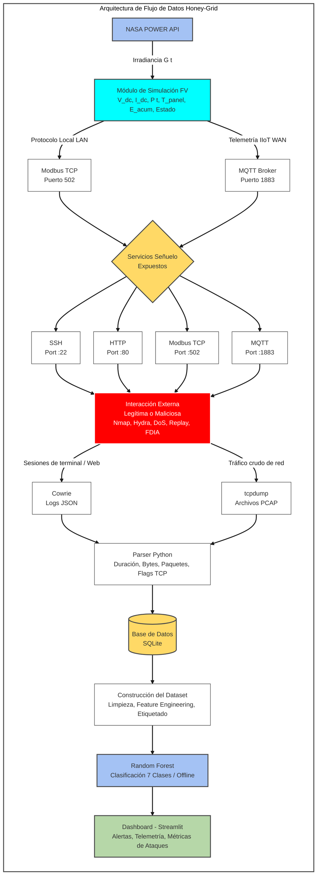

# Arquitectura del sistema

## 1. Introducción

El presente documento describe la arquitectura técnica del sistema propuesto, definiendo los componentes que lo integran, el flujo de información entre ellos y los puntos donde se produce la captura, el procesamiento y la clasificación de eventos de ciberseguridad. La arquitectura ha sido diseñada para ser implementable sobre hardware embebido de bajo costo, específicamente una Raspberry Pi 4, haciendo uso exclusivo de software de licencia libre. Este documento constituye la referencia técnica principal para las fases de implementación del proyecto.

## 2. Descripción general

El sistema opera como un pipeline secuencial e integrado de ocho capas funcionales. En la primera capa, un módulo de simulación fotovoltaica genera telemetría continua y físicamente coherente a partir de datos de irradiancia externos. Esta telemetría alimenta un conjunto de servicios señuelo que conforman el honeypot, el cual expone la superficie de ataque típica de una planta fotovoltaica conectada en red. Toda interacción con dichos servicios es capturada, procesada y persistida en una base de datos relacional. A partir de estos registros se construye un dataset etiquetado que sirve como entrada a un clasificador de Machine Learning, cuyos resultados son presentados en un dashboard unificado junto con la telemetría activa de la planta simulada.

El sistema se despliega íntegramente sobre una Raspberry Pi 4 mediante contenedores Docker, con excepción del entrenamiento del modelo de Machine Learning, que por demanda computacional se realizará en una máquina de soporte. La interacción externa al honeypot puede provenir tanto de tráfico controlado generado en el laboratorio como, potencialmente, de conexiones externas reales.

## 3. Componentes del sistema

### Infraestructura física y de contenedores

| Componente | Función |
|---|---|
| Raspberry Pi 4 (4 GB RAM) | Plataforma de despliegue del honeypot y la simulación FV |
| Docker + Docker Compose | Aislamiento y gestión de servicios mediante contenedores |

### Simulación fotovoltaica

| Componente | Función |
|---|---|
| Modelo de un diodo | Cálculo del comportamiento eléctrico del generador FV |
| Relaciones simplificadas del inversor | Estimación de potencia AC, eficiencia y estado operativo |
| API NASA POWER | Fuente de datos históricos de irradiancia solar de la región |
| Script Python | Publicación periódica de telemetría vía MQTT y Modbus TCP |

### Servicios señuelo

| Servicio | Puerto | Herramienta |
|---|---|---|
| SSH | 22 | Cowrie |
| HTTP | 80 | Servidor web ligero (honeypot) |
| Modbus TCP | 502 | Servidor PyModbus señuelo |
| MQTT | 1883 | Broker Mosquitto |

### Captura y procesamiento

| Componente | Función |
|---|---|
| Cowrie | Captura de sesiones SSH: credenciales, comandos, duración |
| tcpdump | Captura de tráfico general en formato PCAP |
| Parser Python | Conversión de PCAP a eventos estructurados con extracción de features |

### Persistencia

| Componente | Función |
|---|---|
| SQLite | Almacenamiento durante la fase de prototipo en Raspberry Pi |
| PostgreSQL | Migración futura para mayor volumen y concurrencia |

### Machine Learning y visualización

| Componente | Función |
|---|---|
| scikit-learn (Random Forest) | Entrenamiento y evaluación del clasificador supervisado |
| Streamlit | Dashboard de alertas y telemetría (fase inicial) |
| Grafana | Integración futura para visualización avanzada |

## 4. Flujo de información

El flujo de datos sigue la siguiente secuencia lógica de izquierda a derecha y de arriba hacia abajo:

Adicionalmente, la telemetría activa de la simulación fotovoltaica es enviada directamente al dashboard para su visualización en tiempo casi real, de forma independiente al flujo de clasificación.

## 5. Captura de eventos

El sistema define tres puntos de captura principales:

- Punto 1 — Cowrie (SSH/Telnet): captura toda sesión que interactúe con el servicio SSH del honeypot. Registra en formato JSON los intentos de autenticación con sus credenciales, los comandos ejecutados durante la sesión, la duración total y los metadatos de conexión. Cada registro queda persistido en la base de datos con un identificador de sesión único.

- Punto 2 — tcpdump (red general): captura el tráfico de red en los cuatro puertos expuestos por el honeypot en formato PCAP. Estos archivos son procesados por el parser Python, que extrae los atributos de flujo relevantes para el modelo: duración, bytes transmitidos, número de paquetes, conexiones iniciadas y flags TCP. Los registros resultantes son insertados en la base de datos compartiendo el identificador de sesión con los eventos de Cowrie, permitiendo su correlación durante la construcción del dataset.

- Punto 3 — Servicios Modbus y MQTT (protocolo específico): el servidor Modbus TCP señuelo registra cada solicitud recibida, incluyendo el código de función, la dirección inicial del registro accedido y el número de registros involucrados. El broker MQTT registra tópicos, payloads, tamaño de mensaje y tipo de operación (PUBLISH/SUBSCRIBE).

## 6. Construcción del dataset

El dataset se construye a partir de los registros de la base de datos mediante las siguientes etapas:

1. Extracción: recuperación de todos los eventos almacenados con sus atributos completos.
2. Limpieza: eliminación de registros incompletos y tratamiento de valores atípicos.
3. Normalización: escalado de variables numéricas para garantizar comparabilidad entre features.
4. Ingeniería de características: derivación de atributos compuestos a partir de los campos raw de los logs.
5. Etiquetado manual: asignación de la clase correspondiente a cada sesión según el tipo de evento registrado.
6. Partición: división en conjuntos de entrenamiento y prueba con proporciones estándar (80/20).

Las siete clases del dataset son las siguientes:

| Clase | Etiqueta | Descripción |
|---|---|---|
| 0 | Normal | Tráfico legítimo sin indicios de actividad maliciosa |
| 1 | Escaneo | Exploración de puertos o descubrimiento de servicios |
| 2 | Fuerza bruta | Intentos repetidos de autenticación sobre SSH |
| 3 | Manipulación Modbus/MQTT | Acceso no autorizado a registros Modbus o tópicos MQTT |
| 4 | DoS/DDoS | Inundación de conexiones para saturar un servicio |
| 5 | Replay Attack | Reenvío diferido de tramas legítimas para acciones no autorizadas |
| 6 | FDIA | Modificación maliciosa de variables físicas en Modbus o MQTT |

Para las clases 5 y 6, cuya generación experimental controlada puede resultar compleja, se contempla la complementación con muestras de datasets públicos de referencia.

## 7. Integración del clasificador

El clasificador Random Forest recibe como entrada el vector de características construido a partir de los logs del honeypot. Las features de entrada se organizan por protocolo:

- SSH: intentos de autenticación, comandos ejecutados, duración de sesión, variables binarias de resultado de autenticación.
- Modbus TCP: código de función, dirección inicial del registro, número de registros accedidos, tipo de operación (lectura/escritura).
- MQTT: tópico, tamaño del payload, frecuencia de publicación, tipo de operación (PUBLISH/SUBSCRIBE).
- Red general: puerto de destino, tasa de paquetes, bytes transmitidos, duración del flujo, número de conexiones, flags TCP.

El modelo se entrena de forma offline sobre el dataset etiquetado y es evaluado mediante precisión, recall, F1-score por clase, matriz de confusión e importancia de variables. Se realizará una comparativa con SVM y árbol de decisión para fundamentar la elección del clasificador principal.

## 8. Dashboard

El dashboard desarrollado en Streamlit presenta de forma unificada:

- Alertas en tiempo casi real: eventos clasificados por el modelo con su etiqueta de clase y protocolo involucrado.
- Telemetría FV activa: variables operativas actuales de la planta fotovoltaica simulada.
- Historial de eventos: registro cronológico de todas las interacciones detectadas.
- Distribución de ataques: gráficos estadísticos de frecuencia por clase.
- Métricas del modelo: precisión, recall y F1-score actualizados tras cada ciclo de evaluación.

Se contempla la integración futura con Grafana para ampliar las capacidades de visualización en etapas posteriores del proyecto.

## 9. Diagrama arquitectónico

El diagrama oficial del sistema se encuentra en el archivo `arquitectura.png` adjunto a este documento. Representa el flujo completo de información entre los ocho componentes del sistema, desde la fuente de datos externa hasta el dashboard, identificando visualmente las capas funcionales, los puntos de captura y las rutas de datos principales.
