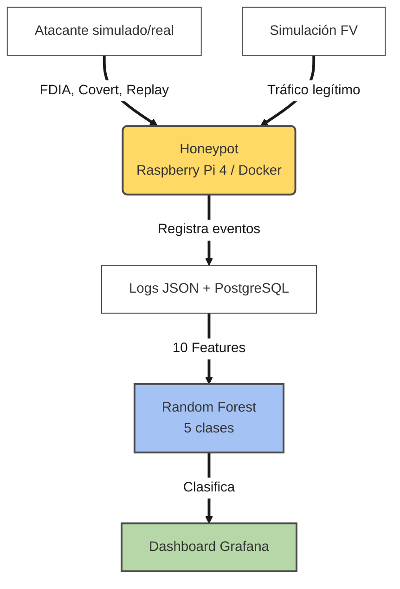

## 1. Contexto del sistema.

#### Planta fotovoltaica.

El mundo global se encuentra en una transición energética impulsada por las distintas fuentes de energías renovables, entre ellas la solar, donde se encuentran las plantas fotovoltaicas, las cuales se transformaron en elementos de generación aislados a nodos críticos e interconectados del sistema eléctrico de potencia. Las plantas modernas constan de tres bloques principales: Bloque de generación, bloque de conversión y bloque de evaluación o interconexión.

Bloque de generación: Este módulo transforma la radiación solar en energía eléctrica. Los paneles solares, configurados en arreglos en serie, en paralelo o mixtos según los requerimientos del sistema, constituyen la unidad.

Bloque de conversión: El inversor, considerado el componente central del sistema fotovoltaico, acondiciona la energía eléctrica generada por los paneles para transformarla en una señal segura y utilizable. Este bloque integra inversores, que convierten corriente continua (CC) a corriente alterna (CA), junto con los sistemas de protección y seccionamiento, incluyendo fusibles, cajas de combinación, diodos de bloqueo y supresores de transitorios (DPS).

Bloque de evaluación o interconexión: En esta etapa se adecúa la energía para su integración o consumo final. Consta de transformadores que elevan el voltaje de baja tensión a niveles industriales para mitigar las pérdidas por transporte. Asimismo, incluye el Punto de Conexión Común (PCC), el cual funge como el nodo físico para el acoplamiento del sistema con la red eléctrica o la carga local, y la medición bidireccional se incorpora a él.

#### SCADA industrial.

En la industria moderna se requiere el control, automatización y supervisión de distintos procesos para lograr la mejor eficiencia, reducir altos costos e identificar problemas antes de que escalen, ahí es donde entran los sistemas SCADA industrial que por sus siglas (Supervisory Control and Data Acquisition) son la solución de software y hardware diseñados en específico para cumplir los requerimientos de supervisión, control y automatización en procesos industriales o infraestructura crítica. 

En caso de los sistemas fotovoltaicos es el encargado de garantizar la eficiencia, estabilidad de la red y el mantenimiento predictivo. El SCADA actúa como el núcleo de la tecnología de la operación (OT), centralizando las lecturas críticas del sistema como lo son: potencias (activas/reactivas), tensión, corriente, irradiancia de piranómetro y temperaturas de celdas, no solo se conecta a la parte de potencia, sino que también está conectado a sensores y actuadores necesarios para la supervisión del sistema lo que permite el envío de información y de comandos de control hacia los inversores como puede ser una regulación de rampa de inyección o seleccionamiento de emergencia.

#### Comunicación Modbus/MQTT.

Dentro del sistema SCADA y la arquitectura híbrida de (OT) se puede encontrar 2 protocolos de comunicación industrial muy fuertes y altamente usados en la industria moderna los cuales son:

- Modbus TCP: Muy usado en redes de área local (LAN) industrial para permitir la comunicación entre el maestro - esclavo en tiempo real, básicamente la conexión entre el servidor SCADA, los registradores de datos (data loggers) y los inversores o unidades de medición (Sensores y Actuadores).

- MQTT(Message Queuing Telemetry Transport): Es un protocolo ligero altamente usado en la industrial el cual se basa en el modelo publicación-suscripción, se usa para telemetría IIoT (Internet de las cosas industrial) el cual se encarga de transmitir y transportar los datos históricos del sistema o de la planta hacia las plataformas de supervisión que puede estar alojada en la nube o en centros de control remoto a través de redes WAN.

## 2. Problema de seguridad.

Históricamente el avance en la energía solar y las tecnologías de la operación (OT) en el sector eléctrico se han enfocado en criterios de desarrollo que priorizan la disponibilidad continua, baja latencia en el control de lazo cerrado y la resiliencia ante fallas físicas o ambientales.

Debido a este enfoque los dispositivos de campo como pueden ser los inversores centrales, los controladores lógicos programables (PLC) y las unidades de terminal remota (RTU) en los sistemas fotovoltaicos no están diseñados para afrontar ciberataques. La arquitectura del hardware se optimizó para ejecutar tareas críticas de tiempo real como algoritmos MPPT o sincronización de fase y PLL, lo que conlleva a una capacidad de procesamiento y memoria muy limitada y restringida. Por lo cual la implementación de capas de seguridad perimetral y criptográfica se omitió intencionalmente.

Además la implementación de protocolos de comunicación como Modbus TCP o MQTT implican una problemática de ciberseguridad, debido la ausencia de diseño de seguridad. El protocolo Modbus TCP el cual opera predominantemente en la capa de control de red local transmite toda la carga por texto plano lo cual carece de mecanismos nativos de seguridad como el cifrado y la autentificación fuerte lo cual conlleva al atacante poder realizar técnicas de sniffing de red e interceptar distintos registros de retención, también permite que cualquier dispositivo que se conecte al nodo de red pueda y tenga permisos para enviar algún código de control o código de función Modbus y que se procese por el inversor.

Por otro lado en le protocolo MQTT permite la implementación de seguridad TLS, esta suele prescindirse de cifrado por la carga computacional lo que facilita a vectores de ataques que se basan en suplantación de identidad (spoofing) y la manipulación de datos de telemetría mediante intermediarios comprometidos (Man-In-The-Middle).

## 3. Amenazas de seguridad.

Dentro de las amenazas de seguridad encontramos:

- Denegación de servicios (DoS/DDoS): Los ataques de Denegación de Servicio (DoS) y Denegación de Servicio Distribuida (DDoS) en entornos FV tienen el objetivo de saturar los recursos de procesamiento en los dispositivos y así lograr ataques de inundación que provoquen un colapso de las interfaces de red en elementos como inversores y data loggers los cuales cuentan con pilas internas de datos limitadas.
- Man-in-the-Middle (MitM): El atacante puede actuar como un intermediario y así pueda espiar entre la telemetría y alterar los paquetes de datos en tránsito antes de llegar al destino final.
- Ataques a la integridad de datos (DIA): Alteración de datos en tránsito para inducir decisiones erróneas. Sé sub clasifica en:
    - FDIA (False Data Injection): El atacante puede inyectar mediciones falsas para engañar algoritmos de estimación/control entre esas se puede modificar datos como la irradiancia de los piranómetro o la temperatura del inversor ocasionando que estos reciban esos datos y actúen de manera errónea.
    - Replay Attacks (RA): Captura y retransmisión diferida de tramas legítimas para ejecutar comandos fuera de contexto o activar actuadores indebidamente, el atacante puede grabar tramas de Modbus TCP correspondientes al funcionamiento nominal óptimo de la planta y posteriormente inyectar dichos datos en otros horarios donde los datos son diferentes para alterar el comportamiento del sistema.
- Covert Attacks (CA): Los atacantes poseen un conocimiento alto profundo de modelos matemáticos del sistema y así mismo modelo físico de la planta, con esta información alteran datos de forma gradual y sigilosa anulando a los detectores de anomalías convencionales que detectan intrusiones y con eso hacer parecer al sistema que el cambio de datos son reales con el objetivo de reducir drásticamente la vida útil de los componentes o que actúen de manera errónea.
- Exfiltración de datos: Extracción silenciosa de datos operativos, propiedad intelectual o configuraciones sensibles. El honeypot actúa como trampa para capturar TTPs (Tactics, Techniques, Procedures) del atacante.

## 4. Consecuencia industrial.

Dentro del contexto de la industria en energía solar la materialización de las amenazas avanzadas como la denegación de servicios, Man-In-The-Middle, los ataques de integridad de datos y la exfiltración de datos pasan de ser un problema común a que se limita a un entorno lógico de software, si no que se traduce a un impacto destructivo de variables físicas del sistema y la estabilidad económica del activo energético, de estas consecuencias se encontraron 4 ejes importantes a detallar:

- Manipulación de generación solar e inestabilidad de la red: Dentro de los parámetros y criterios de los cuales los sistemas fotovoltaicos dependen de operación para cumplir con los códigos de red internacionales como lo es el IEEE1547. Los ataques tipo FDIA se están orientados a cambiar de forma abrupta los parámetros de los lazos de control de potencia activa y reactiva pueden alterar las curvas de inyección de la planta, esto hace que impacte directamente en el balance carga-generación en el sistema de Interconectado Nacional lo que se traduce en grandes caídas de la frecuencia de sistema y desviaciones del voltaje en la subestación aumentando el riesgo de disparos por sub frecuencia en otras centrales y provocando escenarios críticos como la desestabilización del sistema energético nacional.
  
- Pérdidas económicas directas y penalizaciones regulatorias: Las perdidas económicas ocasionadas por ciberataques en sistemas fotovoltaicos implica que mediante la manipulación de los datos de manera sutil como puede ser con ataques como los encubiertos (CA) y FDIA se induzca al apagado del sistema o limitación de la potencia de salida lo que se traduce en pérdidas económicas al dejar de inyectarse a la red cada Kilovatio-hora (kWh) además afectando directamente a los contratos de compra de energía (PPA).
Además también impacta en pérdidas económicas por penalizaciones regulatorias por incumplimientos técnicos del sistema, penalizaciones puestas por los operadores de red, cada empresa generadora que no incumple con las consignas de despacho o que introduzcan perturbaciones al sistema de la red nacional como de calidad de potencia sea de alto parpadeo o flicker, armónicos o desbalances de fase implica en multas al generador de energía ocasionada por manipulación de dichos datos por una persona no afín a la empresa.
  
- Decisiones incorrectas de los sistemas de control y ceguera operativa SCADA: Mediante ataques como los de repetición (RA) o los ataques encubiertos (CA), pueden ocasionar que el sistema SCADA quede completamente aislado de la realidad física de la planta lo que implica en que el software SCADA ejecute algoritmos no deseados de compensación basándose en datos falsos, ante lecturas falsas no reales el sistema SCADA puede tomar la decisión de desconexiones en cascada de inversores ocasionadas por ejemplo por sobre frecuencias, también si el sistema tiene algún problema real como un cortocircuito o una falla del arco y un atacante decide mandar datos falsos de que el sistema real está bien, el sistema SCADA nunca lograra reaccionar y los sistemas de seguridad no actuaran, esto se traduce en prolongación en el tiempo de respuesta ante contingencias de minutos a horas o incluso días lo que amplifica exponencialmente los riesgos de seguridad física de la planta.
  
- Daño catastrófico a infraestructura crítica de potencia: Por último de las consecuencias más peligrosas está el daño catastrófico a infraestructura crítica de potencia, un ciberataque exitoso puede ser la destrucción permanente del hardware físico de la planta significando en altos costos de reparación o en el peor de los casos remplazo e instalación nuevamente y añadiendo los largos tiempos de importación de muchos de los componentes de la planta, por ejemplo los inversores de potencia utilizan transistores bipolares de puerta aislada (IGBT) que conmutan a altas frecuencias. Que una persona logre manipular el firmware o los registros de la configuración interna del inversor puede implicar en que el dispositivo pueda forzar ciclos de conmutación inadecuados, provocando sobrecalentamientos, fatigas térmicas aceleradas, disminuyendo el ciclo de vida útil del componente y aumentando el riesgo de destrucción por cortocircuito de los módulos IGBT.

## 5. Problema final. 

La vulnerabilidad ciberfísica en plantas fotovoltaicas por la ausencia de cifrado y autenticación nativa en los protocolos Modbus TCP y MQTT que gestionan la infraestructura SCADA e IIoT. Esta condición se agrava por un vacío metodológico-industrial: las normativas de seguridad eléctrica prohíben la simulación de vectores de ataque (como FDIA, Covert y Replay Attacks) en entornos de producción reales. En consecuencia, existe una imposibilidad técnica para capturar firmas de tráfico anómalo en redes de Tecnología de la Operación (OT), bloqueando el entrenamiento de algoritmos de aprendizaje automático para la detección de intrusos.

La persistencia de esta vulnerabilidad induce a una ceguera operativa severa, volviendo indetectable la manipulación encubierta de variables críticas para los sistemas de seguridad de TI tradicionales. Sin un entorno de emulación ciberfísico seguro, la infraestructura permanece expuesta a sabotajes remotos capaces de provocar fallas térmicas destructivas en inversores centrales y transformadores. Asimismo, se derivan penalizaciones financieras por sub generación ante el incumplimiento de códigos de red, e inestabilidad de frecuencia y voltaje en el Punto de Conexión Común (PCC), comprometiendo la confiabilidad del sistema interconectado nacional.

## 2. Definición del sistema.

#### Honeypot (qué captura).

Con el propósito de capturar y analizar actividad maliciosa dirigida específicamente a sistemas de generación solar fotovoltaica, se propone la implementación de un sistema honeypot de media interacción sobre una tarjeta de desarrollo Raspberry Pi 4. Dicho sistema tendrá como función principal emular los servicios de comunicación típicos de una planta fotovoltaica real, de manera que cualquier agente externo que acceda a la red del laboratorio perciba un entorno operativo legítimo. Para ello, se contempla la exposición deliberada de cuatro servicios señuelo: un servidor SSH, un servidor HTTP, un servidor Modbus TCP y un bróker MQTT, configurados con parámetros que imiten el comportamiento de equipos industriales propios de este tipo de infraestructura. La inclusión del servidor HTTP responde a que gran parte de los inversores solares modernos incorporan una interfaz web de administración que permite al operador consultar el estado del sistema, configurar parámetros de operación y visualizar históricos de generación; emular dicha interfaz incrementa el realismo del entorno señuelo y amplía la superficie de captura hacia un vector de ataque frecuentemente explotado en infraestructuras industriales conectadas. Cada interacción que se produzca con alguno de estos servicios será registrada en forma de evento estructurado, el cual incluirá información como la dirección IP de origen, el puerto de destino, la marca temporal de la conexión, las credenciales de autenticación empleadas, los comandos ejecutados durante la sesión, los registros Modbus accedidos, los tópicos MQTT manipulados y el tamaño de los datos transmitidos, entre otros atributos relevantes. Estos registros serán almacenados en una base de datos relacional, constituyendo el insumo principal para las etapas posteriores de análisis y clasificación. La selección de los protocolos Modbus TCP y MQTT como superficies de captura se fundamenta en su amplia adopción dentro de los sistemas de monitoreo y control de plantas fotovoltaicas a nivel industrial, lo cual le confiere al sistema propuesto una pertinencia técnica directa con el dominio de aplicación del proyecto.

#### Simulación (qué genera).

Para el procesamiento y clasificación automática de los eventos registrados por el honeypot, se propone el desarrollo de un módulo de detección de intrusiones basado en técnicas de aprendizaje automático supervisado. Este módulo tendrá como objetivo determinar, a partir de los atributos extraídos de cada sesión capturada, a cuál de cinco categorías predefinidas pertenece el evento analizado: tráfico normal, escaneo de puertos, ataque de fuerza bruta sobre el servicio SSH, acceso no autorizado al servidor Modbus TCP, o ataque de denegación de servicio mediante inundación de conexiones TCP. Estas categorías fueron seleccionadas por representar los vectores de ataque más documentados en estudios recientes sobre ciberseguridad de sistemas de control industrial. Se contempla el uso del algoritmo Random Forest como clasificador principal, dado su reconocido desempeño en tareas de detección de intrusiones con datos tabulares, así como su interpretabilidad, que facilitará la discusión de resultados en el documento final. El vector de características de entrada al modelo estará compuesto por atributos derivados directamente de los logs del honeypot, tales como la duración de la sesión, el número de intentos de autenticación, el protocolo utilizado, la tasa de paquetes transmitidos y el número de registros Modbus accedidos, entre otros. El conjunto de datos de entrenamiento se construirá a partir de los eventos recolectados durante la fase de operación del honeypot, y se evaluará la pertinencia de complementarlo con datasets públicos de referencia en el área para garantizar la representatividad de todas las clases definidas. El desempeño del modelo será evaluado mediante métricas estándar de clasificación, y los resultados serán presentados a través de un panel de visualización que permitirá monitorear las alertas generadas en tiempo casi real.

#### Machine Learning (qué detecta).

Para el procesamiento y clasificación automática de los eventos registrados por el honeypot, se propone el desarrollo de un módulo de detección de intrusiones basado en técnicas de aprendizaje automático supervisado. Este módulo tendrá como objetivo determinar, a partir de los atributos extraídos de cada sesión capturada, a cuál de cinco categorías predefinidas pertenece el evento analizado: tráfico normal, escaneo de puertos, ataque de fuerza bruta sobre el servicio SSH, acceso no autorizado al servidor Modbus TCP, o ataque de denegación de servicio mediante inundación de conexiones TCP. Estas categorías fueron seleccionadas por representar los vectores de ataque más documentados en estudios recientes sobre ciberseguridad de sistemas de control industrial. Se contempla el uso del algoritmo Random Forest como clasificador principal, dado su reconocido desempeño en tareas de detección de intrusiones con datos tabulares, así como su interpretabilidad, que facilitará la discusión de resultados en el documento final. El vector de características de entrada al modelo estará compuesto por atributos derivados directamente de los logs del honeypot, tales como la duración de la sesión, el número de intentos de autenticación, el protocolo utilizado, la tasa de paquetes transmitidos y el número de registros Modbus accedidos, entre otros. El conjunto de datos de entrenamiento se construirá a partir de los eventos recolectados durante la fase de operación del honeypot, y se evaluará la pertinencia de complementarlo con datasets públicos de referencia en el área, como UNSW-NB15, para garantizar la representatividad de todas las clases definidas. El desempeño del modelo será evaluado mediante métricas estándar de clasificación, y los resultados serán presentados a través de un panel de visualización que permitirá monitorear las alertas generadas en tiempo casi real.

